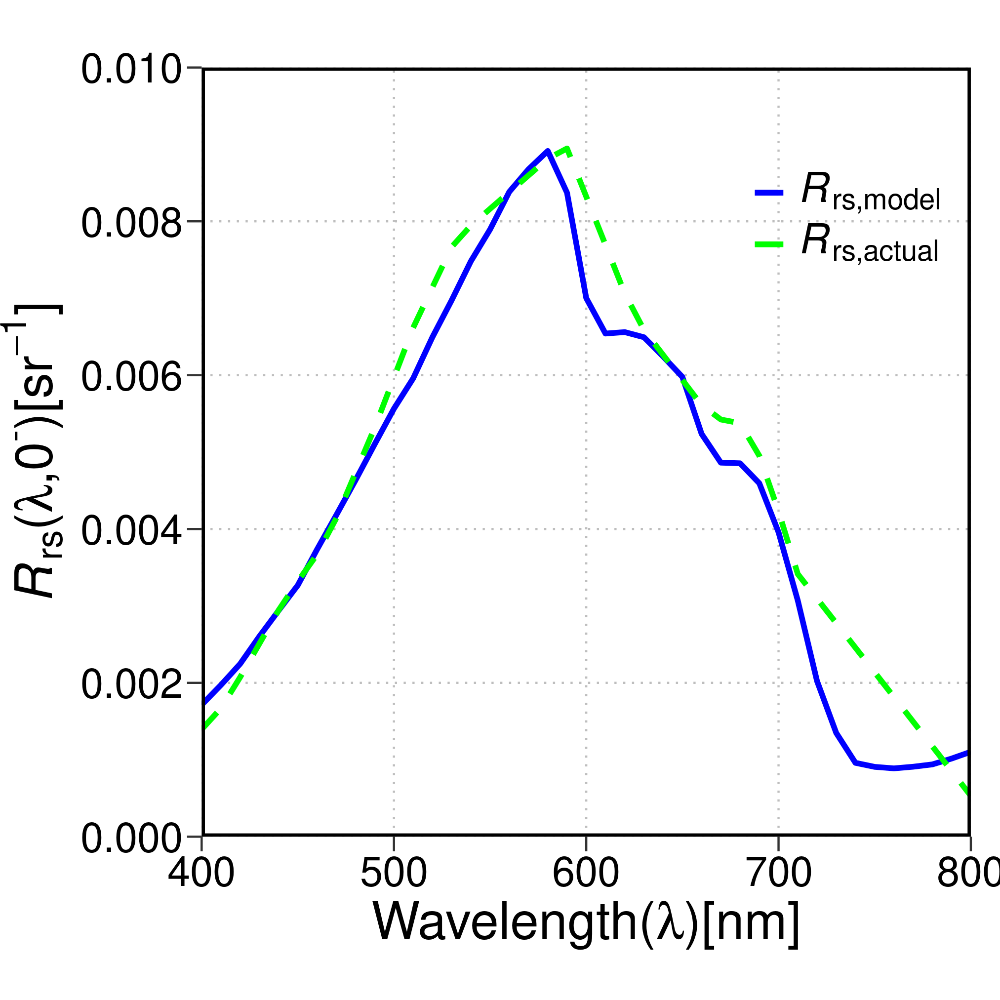
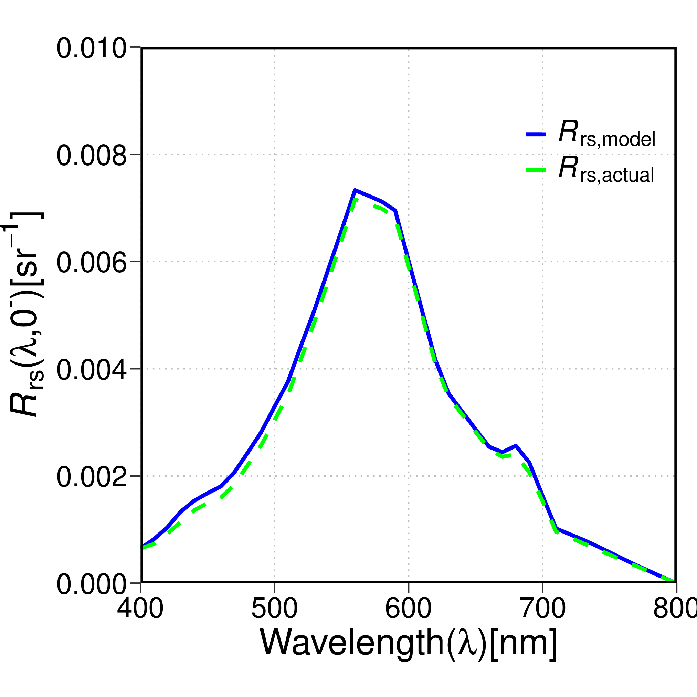
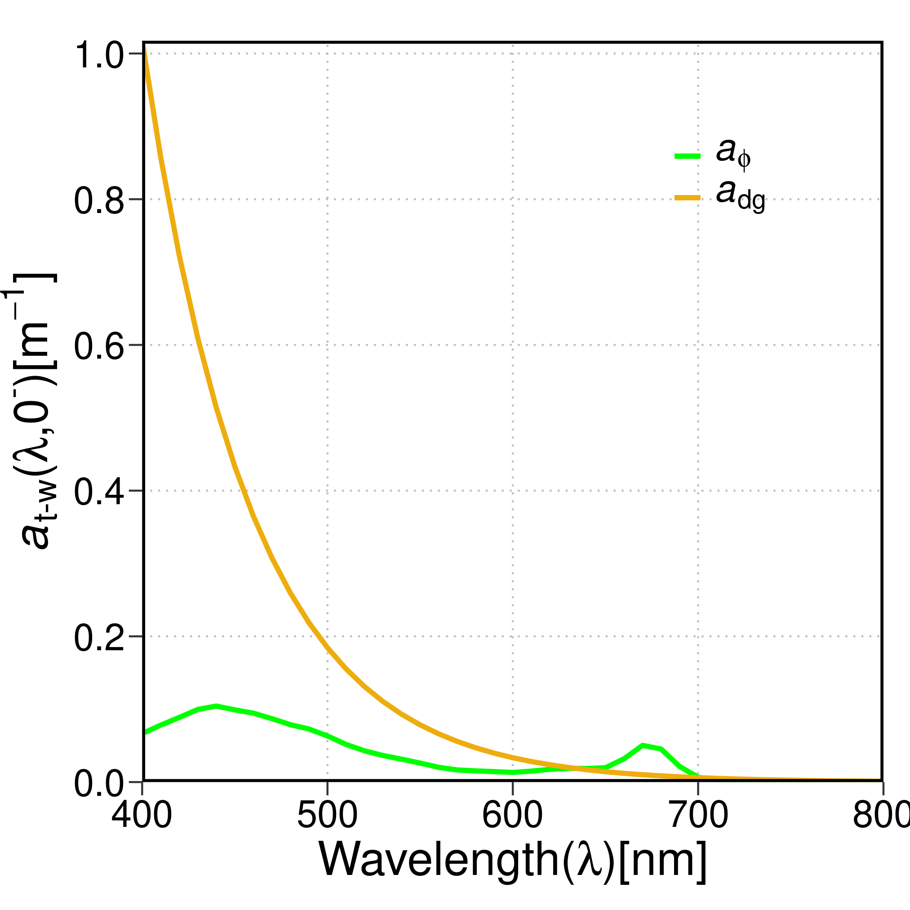
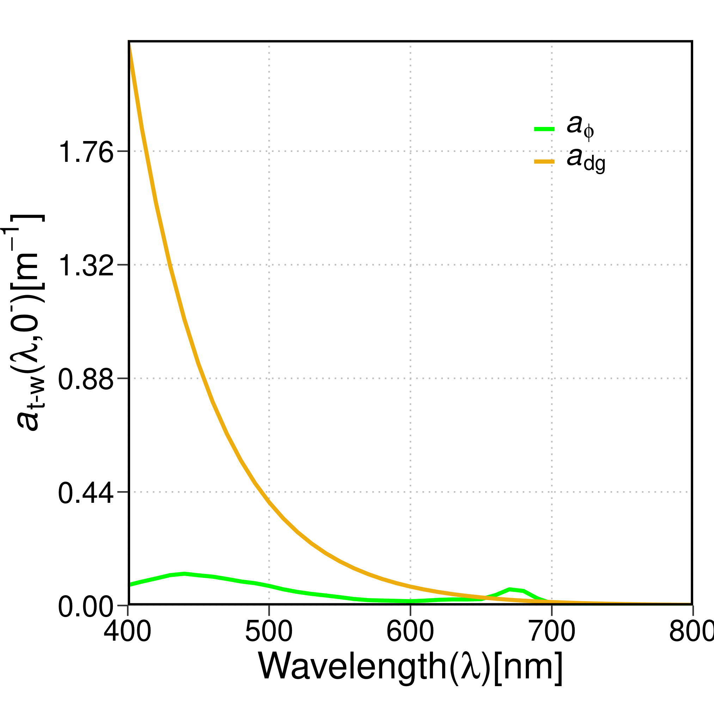
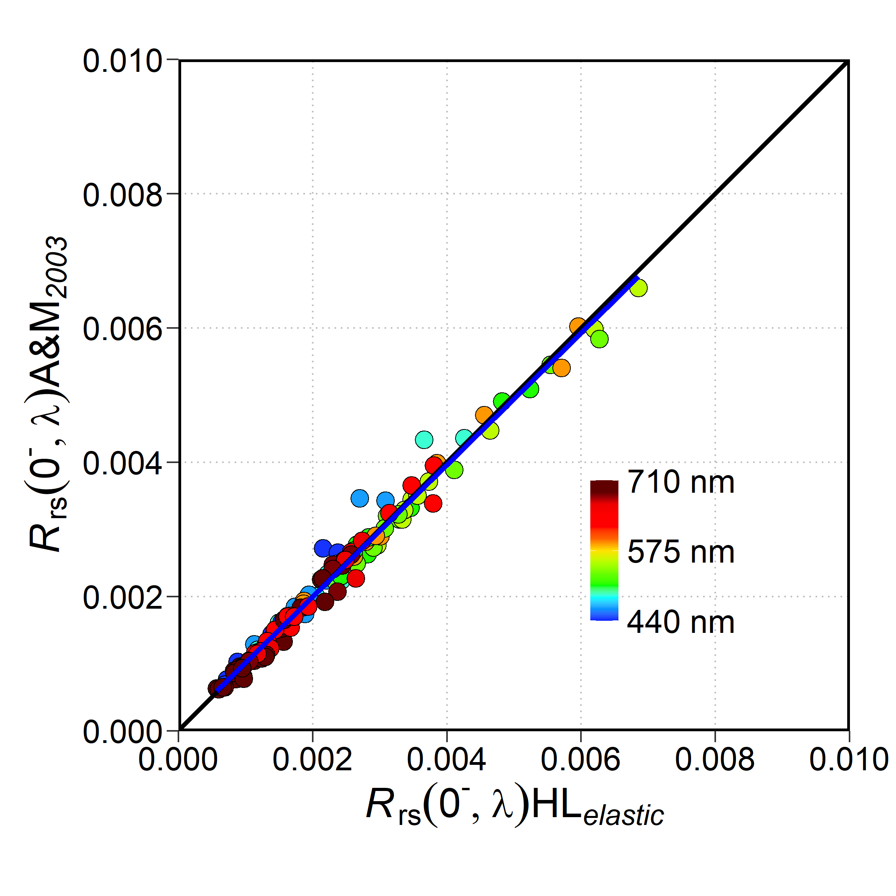
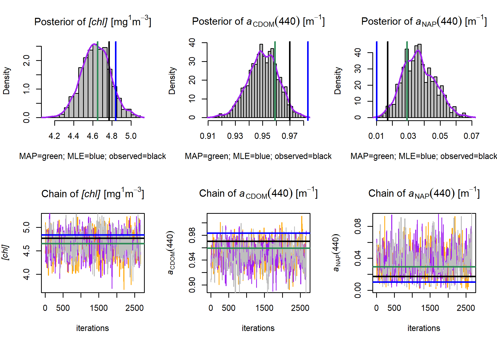
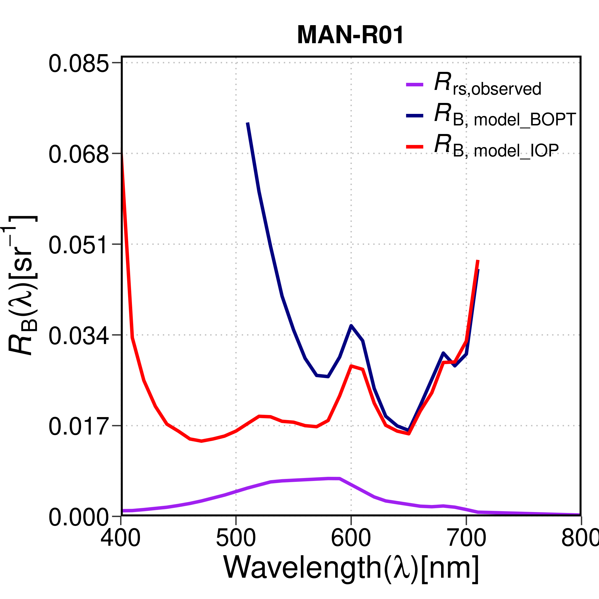

## Semi-Analytical Bayesian Error Retrieval (S.A.B.E.R.) Version 1.0

# Theoretical Background
 
SABER is a software developed in R to solve forward and inverse problems of Ocean Color Remote Sensing (OCRS) across different types of oceanic waters (CASE-I and CASE-II) as well as for inland waters by solving the Scalar Radiative Transfer Equation (SRTE) using Semi-analytical (SA) paramterizations. 

* FORWARD MODEL

The forward model calculates Remote-sensing reflectance ($R_\mathrm{rs}$) from user provided spectral IOPs ($a$ & $b_\mathrm{b}$) using the SA paramterization of SRTE by Albert & Mobley (2003) as default. The wavelengths for IOPs can be supplied in default sensor acquisition wavelengths. In absence of IOPs, _in vivo_ Bio-geo-chemical (BGC) quantities; e.g. Chlorophyll concentration $[chl]$, absorption of Colored Detrital  Matter (CDM); $a_\mathrm{dg}(\lambda = 443)$nm along with particulate backscatter; $b_\mathrm{bP}(\lambda = 555)$nm can be used along with viewing geometry for both the cases to simulate $R_\mathrm{rs}(\lambda)$. In the latter case, _state-of-the-art_ Bio-optical relationships are used to determine BGC component specific $a$ & $b_\mathrm{b}$. In case of shallow waters, where the benthic substrate has substantial upweling optical signal, the bottom depth ($H$) and benthic reflectance ($R_\mathrm{B}$) can also be supplied along with previously mentioned quantities to simulate $R_\mathrm{rs}(\lambda)$ in shallow optically complex waters. The forward model can be simply expressed as $R_\mathrm{rs}(\lambda)=f(a(\lambda),b_\mathrm{b}(\lambda),H, R_\mathrm{B}(\lambda), \theta_\mathrm{v},\Delta\phi_\mathrm{v}, \theta_\mathrm{s})$ where, $a(\lambda)$ and $b_\mathrm{b}(\lambda)$ are absorption and backscatter varying with wavelength $\lambda$, $H$ is bottom depth, $R_\mathrm{B}$ is benthic reflectance, $\theta_\mathrm{v}$ is viewing zenith angle,  $\Delta\phi_\mathrm{v}$ is sensor viewing azimuth angle relative to the solar plane, and $\theta_\mathrm{s}$ is the solar zenith angle. 

 The forward model has two options for paramterization to simulate $R_\mathrm{rs}$, i.e. Albert & Mobley (2003) (AM03 onwards) and Lee et al. (1998) (L98 onwards) for both optically deep and shallow water types. However, currently, AM03 is implemented with a much greater support of bio-optical paramterizations for deriving spectral slopes and calculation of inelastic scattering (SICF and $f_\mathrm{DOM}$). Thus, it is recommended to users to use AM03 to perform forward simulations of SRTE. The AM03 forward model for elastic scattering part can be expressed as below:

$$R_{r s}^{e, m}(\lambda)=R_{r s, \infty} \cdot[1-\exp {-(K_d+\frac{K_{u, W}}{\cos \theta_v}) H}] + (\sum_{i=1}^n f_{a, i} B_i \cdot R_B) \cdot \exp {-(K_d+\frac{K_{u, B}}{\cos \theta_v}) H}$$

+ Where, $R_{r s, \infty}$ is the contribution from water column only (in deep waters, that is the only feasible component) which can be expressed as below:


$$R_{r s, \infty}=f^{\uparrow}\left(\omega_b, \theta_s, u, \theta_v\right) \cdot \omega_b=$$


$$f^{\uparrow}\left(\omega_b\right) \cdot f^{\uparrow}\left(\theta_s\right) \cdot f^{\uparrow}(u) \cdot f^{\uparrow}\left(\theta_v\right) \cdot \omega_b= $$

$$f^{\uparrow}\left(\omega_b\right) \cdot f^{\uparrow}\left(\theta_s\right) \cdot f^{\uparrow}(u) \cdot f^{\uparrow}\left(\theta_v\right) \cdot \omega_b= \\$$


$$P_{r s, 1} \cdot\left(1+P_{r s, 2} \cdot \omega_b+P_{r s, 3} \cdot \omega_b^2+P_{r s, 4} \cdot \omega_b^3\right) \cdot\left(1+P_{r s, 5} \cdot \frac{1}{\cos \theta_s}\right) \cdot(1 \\
\left.+P_{r s, 6} \cdot u\right) \cdot\left(1+P_{r s, 7} \cdot \frac{1}{\cos \theta_v}\right) \cdot \omega_b$$

+ Where, $u$ is wind speed at water surface, $\omega_\mathrm{b}$ is the single-scattering albedo calculated as $\frac{b_\mathrm{b}}{a +b_\mathrm{b}}$ and $P_{r s, 1-7}$ are parametric coefficients. 

+ $K_\mathrm{d}$ and $K_\mathrm{u,W}$ and $K_\mathrm{u,B}$ are downwelling diffused attenuation coefficient and  as diffused attenuation coefficient for upwelling light from water column and bottom respectively. These are paramterized as below:


$$K_d=\kappa_0 \cdot \frac{a+b_b}{\cos \theta_s}, K_u=\left(a+b_b\right) \cdot\left(1+\omega_b\right)^{\kappa_i} \cdot\left(1+\kappa_2 \frac{1}{\cos \theta_s}\right)$$

+ Where, $\kappa_0$, $\kappa_i$ and $\kappa_2$ are parametric coefficients. Among rest, $f_\mathrm{a,i}$ is the areal fraction of $R_\mathrm{B}$ constrained up to five bottom types and $B_\mathrm{i}$ is the Bidirectional Reflectance Distribution Function (BRDF) for each bottom type assumed to be lambertian ($\pi$).

The $a$ and $b_\mathrm{b}$ values can either be _in situ_ IOPs (processed following the IOCCG/NASA protocols) directly or in absence of _in situ_ IOPs, _in vivo_ values of $[chl]$, $a_\mathrm{g}(443)$ and $a_\mathrm{d}(443)$ can be supplied to the forward model. In that case, the subsequent IOPs are calculated as following bio-optical parametrizations:

+ For phytoplankton absorption, $$a_\mathrm{\phi}(\lambda) = (a_\mathrm{0}(\lambda) + a_\mathrm{1}(\lambda) \ln[a_\mathrm{\phi}(443)]) \cdot a_\mathrm{\phi}(443)$$ 
Where, $a_\mathrm{\phi}(443) = 0.06[chl]^{0.65}$, $a_\mathrm{0}$ and $a_\mathrm{1}$ are precomputed parameters from Lee et al. (1994).

+ For coloured detrital matter absorption,
$$a_\mathrm{dg}(\lambda) = a_\mathrm{dg}(443)\exp {(-S_\mathrm{dg}(\lambda - 443))}$$
Where, $-S_\mathrm{dg}$ is the spectral slope which can be retrieved using QAA in deep waters as following:

$S_{\mathrm{dg}}=0.015+\left(\frac{0.002}{0.6+\frac{r_{\mathrm{rs}}(443)}{r_{r s}(555)}}\right)$ The $r_\mathrm{rs}$ is sub-surface Remote-sensing reflectance which can be calculated as $r_\mathrm{rs} = \frac{R_\mathrm{rs}}{0.52 + 1.7 \cdot R_\mathrm{rs}}$. In case of shallow water, a default value of 0.017 is used which can be changed by the user as well (For customization See Section "R-implementation").

+ For particulate backscatter,
$$b_\mathrm{bp}(\lambda) = b_\mathrm{bp}(555){\left (\frac {\lambda}{555} \right)}^\eta$$
Where, $\eta$ is the spectral slope which can be retrieved using QAA in deep waters as following:

$\eta = 2.0 \left(1 - 1.2 \exp { \left( -0.9 \frac {r_\mathrm{rs}(443)} {r_\mathrm{rs}(555)}\right)}  \right)$. In case of shallow water, a default value of -0.46 is used which can be changed by the user as well (For customization See Section "R-implementation").

The forward model also has support for simulation of inelastic scattering in water, i.e. Sun Induced Chlorophyll Fluoroscence (SICF) and CDOM Fluoroscence ($f_\mathrm{DOM}$). The SICF is calculated semi-analytically following the study by Gilerson et al. (2007) whereas the $f_\mathrm{DOM}$ is calculated analytically following Mobley (1994). 

+ SICF affects the wavelengths between 670-710 nm  $\lambda$ with a peak at $\sim 685$ nm. The SICF equivalent radiance at the peak SICF emission wavelength, 685nm, i.e. $L_\mathrm{\phi}(685)$ is calculated as,
$$L_\mathrm{\phi}(685) = \frac {0.092[chl]} {(1+0.40 a_\mathrm{dg}(443) + 0.078[chl])}$$. 
The spectral shape of SICF is modelled as summation of two Gaussian shape with $\mu = 685,730$ and $\sigma = 25,50$ as the Full Wave Half Maximum (FWHM) of the Gaussian curve: 

$$ hc(\lambda) = \sqrt{\frac{4 \ln 2}{\pi}} \frac{1}{25} \exp \left[-4 \ln 2\left(\frac{\lambda-685}{25}\right)^2\right]+ \sqrt{\frac{4 \ln 2}{\pi}} \frac{1}{50} \exp \left[-4 \ln 2\left(\frac{\lambda-730}{50}\right)^2\right] $$

The SICF equivalent radiance for $670 < \lambda < 710$ can be calculated as, $L_\mathrm{SICF} = L_\mathrm{\phi}(685) \cdot hc(\lambda)$. Finally the SICF equivalent $r_\mathrm{rs}$ is calculated as, $r_\mathrm{rs,SICF}=\frac {L_\mathrm{SICF}} {E_\mathrm{d}(0^-)}$, where, $E_\mathrm{d}(0^-)$ is the sub-surface downwelling irradiance.The $E_\mathrm{d}(0^-)$ can either be calculated analytically following Gregg & Carder (1990) or from a user supplied file for Spectral water surface irradiance. 

+ $f_\mathrm{DOM}$ affects $\lambda$ between 310-600nm and the spectral shape can be modelled following a log-normal distribution. As the $f_\mathrm{DOM}$ equivalent radiance, $L_\mathrm{fDOM}$ is calculated analytically by integrating a wavelength discretized source scatter function as 

$$\beta_\mathrm{g} (\psi,\lambda^′,\lambda) =   b_\mathrm{g}(\lambda^′)f_\mathrm{g}(\lambda^′, \lambda)\beta_\mathrm{g} (\psi)$$

Where, $b_\mathrm{g}(\lambda^′)$ is loss of photon at excitation wavelength, $\lambda^′$ which is equivalent to $a_\mathrm{CDOM}(\lambda^′)$. $f_\mathrm{g}(\lambda^′, \lambda)$ is the wavelength redistribution function (WRF) calculated as, $f_\mathrm{g}(\lambda^′, \lambda) = \eta_\mathrm{g}(\lambda^′, \lambda) \frac {\lambda^′} {\lambda}$, where, $\eta_\mathrm{g}(\lambda^′, \lambda)$ is the shape of quantum efficiency of $f_\mathrm{DOM}$ modelled after Howes et al. (1992) as 

$$\eta_\mathrm{g}(\lambda^′, \lambda) = A_0\left(\lambda^{\prime}\right) \exp \left[-\left(\frac{\frac{1}{\lambda}-\frac{A_1}{\lambda^{\prime}}-B_1}{0.6\left(\frac{A_2}{\lambda^{\prime}}+B_2\right)}\right)^2\right] $$

Where, $A_0(\lambda^{\prime}), A_1, A_2, B_1, B_2$ are coefficients given by Howes et al. (1992). The phase function is assumed isotropic thus, $\beta_\mathrm{g} (\psi) = \frac {1} {4\pi}$ is set. Finally, the $f_\mathrm{DOM}$ equivalent $r_\mathrm{rs}$ is calculated as, $r_\mathrm{rs,fDOM}=\frac {L_\mathrm{fDOM}} {E_\mathrm{d}(0^-)}$. The $E_\mathrm{d}(0^-)$ is calculated in a similar way to the same for $r_\mathrm{rs,SICF}$.


* INVERSE MODEL

The inverse model is used to retrieve sub-surface $[chl], a_\mathrm{dg}(443)$ and $H, R_\mathrm{B}$ in case of a shallow water column from _in situ_ or Satelite observations of $R_\mathrm{rs}$. The values are obtained by an optimization routine that tries to find the global mimima for the joint distribution of the paramteric space, $\phi_\mathrm{par} : \{[chl], a_\mathrm{dg}(443), H, R_\mathrm{B}\}^{\mathbb{R}^{\lambda_\mathrm{i} \times D}}$. 

In such problems, a cost/objective function, $s_\mathrm{obj}$ is formulated for $\phi_\mathrm{par}$ which is then minimized in an optimization problem. S.A.B.E.R. has two built-in $s_\mathrm{obj}$, i.e. 1. sum-square-of-residuals similar to OLS predictor and 2. sum of log-likelihood of the forward model where the model error is gaussian in nature with a known mean $\mu=0$ but standard deviation $\sigma$ is unknown. For the optimization routines, there are two set of families of optimizer, i.e. 1. gradient based optimization (Box-constraint/Levenberg-Marquardt) and 2. Bayesian Markov Chain Monte Carlo (MCMC) based sampling. The first type calculates optimal set of parameters by through analytical calculation of the jacobian matrix with respect to the $s_\mathrm{obj}$ and trying to find the point of convergence where the change in hessian matrix becomes flat, i.e. $\frac{\partial{}^2 s_\mathrm{obj}}{\partial{}{[chl]}^2} + \frac{\partial{}^2 s_\mathrm{obj}}{\partial{}{[a_\mathrm{dg}(443)]}^2} + \frac{\partial{}^2 s_\mathrm{obj}}{\partial{}{[H]}^2} + \frac{\partial{}^2 s_\mathrm{obj}}{\partial{}{[R_\mathrm{B}]}^2} = 0$. However, as the inversion of SRTE in optically complex waters is _ill-posed_ problem, gradient-based solutions may tend to retrieve mathematically ambiguous sets of parameters, moreover, such solvers are sensitive to initial values, it can take a long time to reach the global minima or sometimes, it may fail to reach the global minima. To mitigate such problems in inversion of SRTE, an additional probabilistic sampling scheme, MCMC has been integrated in S.A.B.E.R. 

The MCMC framework randomly samples parametric sets following a probabilistic candidate function and compare the quadrature in $s_\mathrm{obj}$. The convergence here in MCMC is diagnosed by reaching _stationary distribution_ for the parametric space. The posterior distribution, which is the joint probability distribution of parameter space, is calculated as: 
$$\mathbb{P}(par|R_\mathrm{rs}) \propto \mathbb{P}(par) \mathbb{P}(R_\mathrm{rs}|par)$$

Where $\mathbb{P}(par)$ is the prior probability of parameters. S.A.B.E.R. is developed with _Weibull_ family of distribution for $[chl], a_\mathrm{dg}(443)$ and $H$ following the assumption that the values can never be negative in reality. The density function is given as: $\{ f(x; \lambda, k) = \frac {k} {\lambda} \left(\frac {x} {\lambda}\right)^{k-1}\exp{(\frac {-x} {\lambda})^k} \} \exists \{ x \geq 0 \}$ where,$\lambda,k$ are the scale and shape parameter of the density function. For shallow water parameter $R_\mathrm{B}$, which is expressed as a linear mixture of fractions of possible bottom class, is assumed to be _Uniform_ distribution in nature varying between 0-1. The density function is given as: $\{f(x)=\frac {1}{b-a} \} \exists \{ a \leq x \geq \forall a=0, b=1 \}$ where $\mathbb{P}(R_\mathrm{rs}|par)$ is the log-likelihood of the forward model which actually infers the model noise which is found to be Gaussian, thus the log-likelihood can be expressed as:

$$
\log \left(\mathcal{L}\left(\mu, \sigma^2\right)\right)=-\frac{n}{2} \log \left(2 \pi \sigma^2\right)-\frac{1}{2 \sigma^2} \sum_{i-1}^n\left(x_i-\mu\right)^2
$$

Where, $x_\mathrm{i}$ is the observed $R_\mathrm{rs}$; $R_\mathrm{rs, obs}$ that is input to the inverse problem and $\mu$ is the forward SA.B.E.R. simulated $R_\mathrm{rs}$, The population standard deviation $\sigma$ is usually unknown and also retrieved as a parameter from the inversion.

The MCMC sampling can be performed in a variety of stochastic approaches, S.A.B.E.R. is default with the "Delayed Rejection Metropolis-Hastings" algorithm and a parallel computation of log-likelihood values for a large number, i.e. 10,000 number of iterations. Initial ~2500 iterations are discarded as _"burn-in"_ period prior to ascension to stationarity. Post reaching stationary distribution, _"Maximum-a-Posterior"_ (MAP) estimates; $\theta_\mathrm{MAP} = \underset{par}{\operatorname{argmax}} \mathbb{P}(par|R_\mathrm{rs})$  are obtained as optimal model solutions of $par$, i.e. $[chl], a_\mathrm{dg}(443)$, $H$ and $R_\mathrm{B}$ fractions. The parametric uncertainty is also retrieved from MCMC chains as _"Credible intervals"_. 

Apart from full parametric inversion as described below, an additional retrieval of spectral bottom reflectance;$R_\mathrm{B}(\lambda)$ using algebraic simplification of the AM03 forward model has been included in S.A.B.E.R. However, it is only to be used when the rest of the parameters, i.e. BGC parameters such as $[chl], a_\mathrm{dg}(443)$ or the IOPs and $H$ are known. Moreover, the $R_\mathrm{rs,SICF}$ and $R_\mathrm{rs,fDOM}$ components should be subtracted from the $R_\mathrm{rs, obs}$ prior to input in the following model where $R_{r s}^{obs,e}$ is inelastic component contribution excluded $R_\mathrm{rs, obs}$:

$$ R_B = \frac{R_{r s}^{obs,e}(\lambda) - R_{r s, \infty} \cdot [1 - \exp{(-(K_d + \frac{K_{u,W}}{\cos \theta_v})H)}]}{\exp{(-(K_d + \frac{K_{u,B}}{\cos \theta_v})H)}} $$

# R-Implmentation

* FORWARD RUN

Prior to run the forward model, a set of global variables are needed to be set for the functions to work accurately. The variable structure is shown below.

```
#--------------------------------------------------------------------------
## 1. Inputs
#--------------------------------------------------------------------------

#1.1 Water type specifications
type_case_water = 2 #Set 1 or 2
type_Rrs_below = "deep" #Set "deep" or "shallow"
type_Rrs_water = "below_surface" #Set any "below_surface", "above_surface_only", "above_surface_with_glint"

#1.2 IOP and acquisition specifications
batch=FALSE #Set TRUE for using forward or inverse batch runs with IOCCG 2003 synthetic data 
            #The IOCCG data is included with S.A.B.E.R.; Note, This parameter is recommended to FALSE.

insitu.present=TRUE #Set TRUE if in situ or simulated observations exist else set FALSE
insitu_type = c("HL", "COPS") #Type of observation, Hydrolight Simulated (HL) or field acquired (COPS)
insitu.type = insitu_type[2] #<<USER INPUT >> selection for type of in situ data

statname = "OUT-R01" #if insitu.present = TRUE, set the station-name (optional)


use_bb_nup = TRUE #Set TRUE If bbp555 should be calculated using in situ spectral slope 

plot=FALSE #Set TRUE when the function outputs and intermediate outputs needed to be saved onto disk


#1.3 Inversion specifications
preFit = FALSE #Set TRUE if a prefit of parameters is opted. The prefit algorithm uses a similar method to 
               # C.R.I.S.T.A.L. inversion approach by Mobley (200*)

use.lklhood= TRUE #Set TRUE (recomended) if the model likelihood is opted to be used in MCMC sampling.

use.wise.prior = FALSE #Set TRUE if the conjugate prior for MCMC is built from WISE-Man 2019 data
                       #Recomended for inversion in CDOM rich coastal waters.
use.nomad.prior = TRUE #Set TRUE if the conjugate prior for MCMC is built from NOMAD data
                       #Recomended for inversion in general case-II waters.
use.ioccg.prior = FALSE #Set TRUE if the conjugate prior for MCMC is built from IOCCG2003 data,
                        #Please Note, BATCH should be TRUE in this case. not recomended. 

#1.4  Desired Wavelength for the simulation
wavelength <- seq(400,800,10)


#1.5 Viewing geometry in degrees
view = 0 #Sensor Viewing angle
sun_above  = 60 #Sun Zenith angle at water surface

sun = sunzen_below(sun_zen_aove = sun_above) #Sun Zenith translated to subsurface.
                                            #Make sure you pass "sun" for subsurface calculation of R_rs.

#1.6 bottom depth
zB=2

#1.7 Areal fraction of bottom reflectance (The total sum must be = 1)
fA0=0; # constant (Excluded from Model) 
fA1=0.2; # sand
fA2=0.2; # sediment
fA3=0; # Chara contraria
fA4=0.6; # Potamogeton perfoliatus
fA5=0; # Potamogeton pectinatus

fA.set= c(fA1,fA2,fA3,fA4,fA5) #exclude the constant fA0

#1.7 Atmospheric conditions

# Irradiance intensities [1/sr]
g_dd=0.05; g_dsr=0; g_dsa=0;

# Intensities of light sources 
f_dd= 1; f_ds= 1;

# Angstrom exponent
alpha = 1.317;

# Atmospheric pressure 
P = 1013.25; # [mbar]

# Relative Humidity
RH = 0.60;

# Scale height for ozone
Hoz=0.300; # [cm]

# Scale height of the precipitate water in the atmosphere
WV= 2.500; # [cm]
```

The forward model can be called from the function `Saber_forward_final()`. The function needs the earlier mentioned global variables as prerequisites. The user is recommended to refer to `main.R` (or the block above) for blocks of parametric initialization. (**NOTE: In future, these global variables will be converted into package environmental variables). Additionally, The `Saber_forward_final()` takes a range of input arguments on IOPs, BGC variables, Fluorescence etc. to implement the forward model. An example is shown below.

```
forward_op_am03 <- Saber_forward_final(
                  ### IOP Options ###
                  use_true_IOPs = T, #Turn TRUE if True IOPs are to be used
                                              
                  a_non_water_path =  #path for absorption IOP file in .csv with "wave" and "a" column,
                  bb_non_water_path = #path for backscatter IOP file in .csv with "wave" and "bb" column,
                  
                  ### BGC variable Options ###                            
                  chl = #Enter [chl] if use_true_IOPs=F, 
                                              
                  acdom440 =NULL, #Enter a_CDOM(440) value if user want to keep CDOM, NAP absorption discrete.
                  anap440 =NULL , #Enter a_NAP(440) value if user want to keep CDOM, NAP absorption discrete.
                                              
                  a_dg = 2.5, #Enter a_dg(440) value if user want to combine CDOM and NAP  absorption.
                                              
                  bbp.550 = 0.05 #Enter [bbp(550)] if use_true_IOPs=F,
                  
                  ### Shallow water Options ###                            
                  z = zB #Enter bottom depth,
                  rb.fraction = fa.set #Aerial fraction of bottom for pre-stored bottom-class,
                  use_spectral_rb = F #Set TRUE if user wants to input own bottom reflectance file, 
                  spectral_rb_path = #Path for user-defined bottom reflectance,
                  
                  ### AOP data ###                            
                  realdata = surface_rrs_translate(Rrs = insitu.data), #Actual observation, if exists.
                  
                  ### Bio-Optical Options ###                          
                  slope.parametric = T, #Set TRUE if user wants to calculate spectral slope from QAA
                  dg_composite = T, #Set TRUE if user wants to combine aCDOM and aNAP
                  use_spectral_shape_chl = F, #Set TRUE if [chl] spectral shape normalization is required
                  use_spectral_shape_dg = T, #Set TRUE if a_dg spectral shape normalization is required
                  
                  ### Inelastic scattering Options ###                            
                  sicf = T, #Set TRUE if SICF is needed to be included
                  q_phi = 0.05, #SICF quantum yield
                                              
                  use_analytic_Ed = T, #Set TRUE if Ed is to be calculated from Solar Geometry
                                              
                  fDOM = T, #Set TRUE if fDOM is to be included 
                  sunzen_Ed = -99, #Sun zenith input Ed calculation. -99 means calculate from geometry
                  lat_Ed = 49.02487, lon_Ed = -68.37059, #lat and long for Ed
                  date_time_Ed = "2019-08-18 20:59 GMT", #date and time in GMT for Ed
                  Ed_fDOM_path = "./data/Ed_HL.csv", #Path for user-defined Ed file
                  use_fDOM_rad = F, #set TRUE if user wants to retrieve fDOM radiance instead reflectance
                  
                  ### Plot and Print options ###                          
                  verbose = F, #Print progress in command line
                  plot = T #Save component specific absorption and forward model generated spectra on disk)
```
An example of the forward S.A.B.E.R. output is illustrated below, where the forward simulated $R_\mathrm{rs}$ is compared with the corresponding _in situ_ observation of $R_\mathrm{rs}$. Here, the forward simulations are performed with field acquired IOPs with SICF and $f_\mathrm{DOM}$ included. The spectral slope for $b_\mathrm{bp}$ was derived from QAAv5. The forward simulation can be saved to disc as following plots when `plot=TRUE`.

<figure>
<center>
 
</center>
</figure>


<!-- <table>
    <tr>
    <td style='text-align:center;'>
         <b> a </b>
    </td>
    <td> 
        
    <p style='text-align: center; margin-center: 3em; font-family: Serif;'><b> b </b></p>
    </td>
    </tr>
</table>--->

The forward model calculated component specific absorption can also be retrieved as outputs when `plot=TRUE` is set in the function `Saber_forward_final()`. A couple of examples are shown below.

<figure>
<center>
 
</center>
</figure>

We validated the forward S.A.B.E.R. model generated $R_\mathrm{rs}$ through comparison with Hydrolight v6.0  obtained $R_\mathrm{rs}$ for a set of synthetic sets of IOPs, the IOP ranges were determined to keep similar spatial variability to of IOCCG 2003 dataset. The validation plot of the model is presented below.

<center>
 
</center>

* INVERSE RUN

The inverse mode of S.A.B.E.R. can be used to retrieve deep water BGC parameters, i.e. $[chl]$ and $a_\mathrm{dg}(443)$ or $a_\mathrm{g}(443)$ and $a_\mathrm{d}(443)$ separately and in shallow waters, additionally $H$ and aerial fractions of $R_\mathrm{B}$ can also be retrieved. One thing to note, The inverse mode cannot retrieve spectral IOPs as in such scenario, each wavelength has to be turned into a separate inverse problem, where the high degree of correlation between spectral domain of IOPs will lead to erroneous values, moreover, for a single observation of $R_\mathrm{rs}$ it would be needed to retrieve IOPs for various values of $\lambda \ge n_\mathrm{R_\mathrm{rs}}$, which violates the constraints of algebra as well. The different families of optimization based inversion is explained below.

- Gradient based optimization

The gradient based inversion in S.A.B.E.R. can be performed via calling the family of `solve.objective.*()` family of functions. For inversion in optically deep waters, the function `solve.objective.inverse()` can be called to retrieve $[chl]$ and $a_\mathrm{dg}(443)$ or $a_\mathrm{g}(443)$ and $a_\mathrm{d}(443)$ separately through setting the function argument `dg.composite = TRUE/FALSE`. In shallow waters, inversion can be performed by calling the function `solve.objective.inverse.shallow.constrained.batch()` where user can either retrieve all the unknown parameters, i.e. $H$ and $R_\mathrm{B}$ along with previously stated deep water parameters or only retrieve the $H$ and $R_\mathrm{B}$ by turning the `constrained=TRUE`, where the deep water parameters are assumed known to user and needed to input via the function argument `constrain.param = as.numeric(c("chl", "a_g", "a_d"))`. For batch runs on a set of $R_\mathrm{rs}$ observations, refer to the R-code `SABER.batch.shallow.R`where a bunch of $R_\mathrm{rs}$ observations are split into partitions and inverted in `constrained=TRUE` mode. An example consisting both implementations to `solve.objective.inverse()` for inversion in deep and shallow  water is shown below.

```
obj = c("log-LL", "SSR") #types of s_obj. in S.A.B.E.R. 
obj.run <- obj[1] #Select the desired one

methods.opt <- c("Nelder-Mead", "BFGS", "CG", "L-BFGS-B", "SANN", 
                 "Brent","levenberg-marqardt") #Types of optimizers in S.A.B.E.R.

#Do the inversion for optically deep waters
inverse_output <- solve.objective.inverse(
                                  initial = par0, # a vector of initial values
                                  obsdata = obsdata, # a vector of R_rs observations to be inverted
                                            
                                  sa.model = "am03", #choice of SA model to be used, i.e. am03 or lee98
                                            
                                 obj.fn =obj.run , #objective function that 
                                 method.opt = methods.opt[4], #optimization type 
                                            
                                 lower.b = lower.bound, #a vector same size as par0 denoting search mimima
                                 upper.b = upper.bound, #a vector same size as par0 denoting search maxima
                                            
                                 )
                                 
#Do the inversion for optically shallow waters
inverse_output <- solve.objective.inverse.shallow.constrained.batch(
                                constrained = T, #set TRUE if constrained inversion is to be performed
                                constrain.param = as.numeric(bgc_data), #vector of chl, a_d(443) and a_g(443)
                                
                                initial = as.numeric(par0), 
                                obsdata = obsdata,
                                
                                sa.model = "lee98", 
                                obj.fn =obj.run , 
                                method.opt = methods.opt[4],
                                lower.b = lower.bound,
                                upper.b = upper.bound, 
                               )
```
The run-time status of the optimization following the calculation of parametric uncertainty is output to console by default. The output of the inversion is returned as a `list` type with parameter estimates as `estimates` and its associated uncertainty as `sd(+/-)`, the state of convergence, `convergence` if it's global, set to `TRUE` and lastly `time.elapsed` for the run-time of total inversion process. An example of the inversion output is shown below.

```
          #################### INVERSION BEGINS #########################
          Initial values are 4    1    0.1
          #################### OPTIMIZATION INITIALIZING #########################
          [1] "Albert & Mobley 2003 SA model used for Likelihood calculation"
          #################### OPTIMIZATION ENDS #########################
          #################### CALCULATE UNCERTAINITY: START #########################
          #################### VAR-COV HESSIAN MATRIX #########################
                                    chl.chl acdom440.acdom440 anap440.anap440 pop.sd.population.sd
          chl.chl               33226637.27         773471193     952340562.3            -17772.44
          acdom440.acdom440    773471193.17       18905911186   22953282059.4          -7818362.15
          anap440.anap440      952340562.25       22953282059   28185321774.9           -137212.33
          pop.sd.population.sd    -17772.44          -7818362       -137212.3           -924498.61
          #################### CALCULATE UNCERTAINITY: END #########################
          [1] "The retrieved parameters are:"
               param                  estimates    sd(+/-)       
          [1,] "chl.chl"              "2.34205451" "9.831540e-04"
          [2,] "acdom440.acdom440"    "0.45545999" "6.041652e-05"
          [3,] "anap440.anap440"      "0.05834172" "6.275947e-05"
          [4,] "pop.sd.population.sd" "0.00600000" NA            
          #################### INVERSION ENDS #########################
          
          #THE OUTPUT DATASTRUCTURE FROM INVERSION
          > head(inverse_output)
          [[1]]
                            param  estimates      sd(+/-)
          1:              chl.chl 2.34205451 9.831540e-04
          2:    acdom440.acdom440 0.45545999 6.041652e-05
          3:      anap440.anap440 0.05834172 6.275947e-05
          4: pop.sd.population.sd 0.00600000          NaN
          
          $convergence
          [1] "TRUE"
          
          $time.elapsed
          Time difference of 22.26629 secs
```

- MCMC based optimization

The MCMC sampling in S.A.B.E.R. is performed with integrating the `bayesiantools` R-package Sampling functions with OCRS specific Prior density function and prior sampling with likelihood function of the forward model. The prior data for deep parameters, $[chl]$, $a_\mathrm{g}(443)$ and $a_\mathrm{d}(443)$ can be created from either IOCCG2003, SEABASS NOMAD or WISE-Man2019 _in situ_ datasets. The function `create.prior.data()` should be used to create the data-frame to create the conjugate prior density function for parameters. The prior density and corresponding sampling function can be obtained from the functions `prior()` and `sampler()` respectively. Upon generation of prior densty function, the priortype class is created to be used in MCMC. The function `BayesianTools::createPrior()` can be used to create the prior object. Next, the Bayesian Posterior function is formulated by the function `BayesianTools::createBayesianSetup()` where the `likelihood` argument is the log-likelihood function of the forward SA model, it is default provided by the S.A.B.E.R. function `ll()`. Finally, the MCMC sampling is performed via the function `BayesianTools::runMCMC()` to sample the paramteric space using one of the sampling techniques integrated with `BayesianTools`. An example of the MCMC implementation is shown below.

```
#------------------------------------------------------------------------------------
#Implement MCMC optimization
#------------------------------------------------------------------------------------
prior_fit = create.prior.data(use.ioccg.prior = F, use.wise.prior = F,
                  use.nomad.prior = T) #Create the Data to create Prior Density function

# Store the scale and shape parameters for WEibull density functions for deep water parameters
fit.chl.norm = prior_fit$fit.chl 
fit.acdom440.norm = prior_fit$fit.acdom440
fit.anap440.norm = prior_fit$fit.anap440

# Create prior density and sampling class
if (pop.sd == "unknown" & type_Rrs_below == "deep") {
  
  prior.actual <- BayesianTools::createPrior(
                                 density = prior, #prior is a pre-defined weibull density function
                                 sampler = sampler,#sampler is a pre-defined weibull sampling function
                                 
                                 lower = c(0,0,0,0.0001),   # <<USER DEFINED>> maxima
                                 upper = c(30,5,0.5, 0.01), # <<USER DEFINED>> minima
                                 best = NULL #Or can be a vector of size=lower or upper 
                                 )
                                
}


# Create Bayesian setup for MCMC
# prior-scaling
if (use.lklhood == FALSE) {
  bayessetup <- createBayesianSetup(prior = prior.actual,
                                    likelihood = ll,
                                    #lower = c(0,0,0),  # <<USER DEFINED>> minima
                                    upper = c(30,5,0.5),# <<USER DEFINED>> maxima
                                    names = c("chl","acdom440","anap440", "pop.sd"), 
                                    parallel = F)
}

# likelihood-maximization
if (use.lklhood == TRUE) {
  bayessetup <- createBayesianSetup(prior = NULL,
                                    likelihood = ll,
                                    lower = c(0,0,0,0.0001), # <<USER DEFINED>> minima 
                                    upper =c(30,5,0.5, 0.01),# <<USER DEFINED>> maxima
                                    names = c("chl","acdom440","anap440", "pop.sd"),
                                    parallel = F)
  
}

# Test if the setup is initiated for theta pars
checkBayesianSetup(bayessetup) 

# Set MCMC config
settings = list(iterations = 10000, message = TRUE, nrChains = 1, burnin=2000) #burn-in count is discarded
samplerlist <-c("Metropolis", "AM", "DR", "DRAM", "DE", "DEzs", "DREAM", "DREAMzs", "SMC") #Sampler list

# Run MCMC
out <- runMCMC(bayesianSetup = bayessetup, settings = settings, sampler = samplerlist[6]) #Run MCMC
summary(out) #Print MCMC diagnostics to console

# MCMC diagnostics
plot(out, start = 2000) #chain and parameter density
correlationPlot(out, start = 2000) #correlation plot among parameters
marginalPlot(out, start = 2000) #Variation in marginal prob density of prior and posterior

# MCMC final estimates
MAP.mcmc <- MAP(out) #Store MAP
DIC.mcmc <- DIC(out) #Store DIC
```
The output of MCMC in `out` can be viewed using `coda` package tools for MCMC visualization. An example illustration of MCMC retrieved parameters is shown below. 

<center>
 
</center>

The output MCMC chains in `out` can also be used to track the optimization process to illustrate the degree of randomness in the sampling. An example is illustrated below where the joint log-likelihood of the forward model is maximized through MCMC sampling to retrieve optimal parameter plane of deep water parameters in optically complex waters.

<center>
 
</center>

- Spectral $R_\mathrm{B}(\lambda)$ retrieval

The $R_\mathrm{B}(\lambda)$ values can be retrieved using the function `Saber_retrieve_rb_wise()` which must be provided with subsurface $R_\mathrm{rs}$ as AOP input along with coherent IOPs or BGC variables and water column depth $H$. An example of how to run the function is showed below.

```
#Retrieve spectral Rb from forward SABER generated Rrs with True IOPs
      Rrs_bottom_est_iop = Saber_retrieve_rb_wise(
                             use_true_IOPs = T, #TRUE if user IOPs are supplied
                             a_non_water_path = IOP_files[idx_a_rb], #path for absorption file
                             bb_non_water_path = IOP_files[idx_bb_rb], #path for backscatter file
                                                  
                             chl = bgc_params_rb$chl_invivo, #[chl] value, only if use_true_IOPs=F
                             acdom440 =bgc_params_rb$a_cdom, #[acdom443] value, only if use_true_IOPs=F
                             anap440 = bgc_params_rb$a_nap, #[anap443] value, only if use_true_IOPs=F
                             bbp.550 = bgc_params_rb$bbp555, #[bbp555] value, only if use_true_IOPs=F
                                                  
                             slope.parametric = F, #True QAA derived spectral slope (not recomended)
                             dg_composite = F, #True if acdom and anap should be merged

                             z = iop_aop_rb$zB_COPS, #water column depth
                                                  
                             obs_rrs = obs_rrs #sub-surface Rrs
                             )
```
An additional user specific batch option is available to retrieve spectral $R_\mathrm{B}(\lambda)$ for multiple field observations. The function can be called via `Saber_generate_rb_batch()` with `staionlist` as the function arguement which expects a vector of characters reflecting the field station names where subsequent observations of IOPs and AOPs are available. As of now, this function can work with data structure generated from `Riops::Generate.IOP.DB()` function which generates subsurface observations of IOPs in a single .csv file. In future, the function will be extended to work on general data structures. An example of the $R_\mathrm{B}(\lambda)$ retrieved from an _in situ_ station with $\sim2.5m$ depth in CDOM rich coastal waters. In this example, The model was tested with both IOP data and BGC data to see how it impacted the $R_\mathrm{B}(\lambda)$ retrieval.


<center>
 
</center>


# REFERENCES

Albert, A., & Mobley, C. (2003). An analytical model for subsurface irradiance and remote sensing reflectance in deep and shallow case-2 waters. Optics Express, 11(22), 2873. https://doi.org/10.1364/oe.11.002873

A. Gilerson, J. Zhou, S. Hlaing, I. Ioannou, J. Schalles, 
B. Gross, F. Moshary, and S. Ahmed, "Fluorescence component in the reflectance spectra 
from coastal waters. Dependence on water composition," Opt. Express 15, 
15702-15721 (2007)

Gregg, Watson W., Carder, K. L., (1990), A simple spectral solar irradiance model for cloudless maritime atmospheres, Limnology and Oceanography, 35, doi: 10.4319/lo.1990.35.8.1657.

Lee, Z., Carder, K. L., Hawes, S. K., Steward, R. G., Peacock, T. G., & Davis, C. O. (1994). Model for the interpretation of hyperspectral remote-sensing reflectance. Applied Optics, 33(24), 5721. https://doi.org/10.1364/AO.33.005721

Lee, Z., Carder, K. L., Mobley, C. D., Steward, R. G., & Patch, J. S. (1998). Hyperspectral remote sensing for shallow waters I A semianalytical model. Applied Optics, 37(27), 6329. https://doi.org/10.1364/ao.37.006329

Lee, ZhongPing, Carder, K. L., & Arnone, R. A. (2002). Deriving inherent optical properties from water color: a multiband quasi-analytical algorithm for optically deep waters. Applied Optics, 41(27), 5755. https://doi.org/10.1364/ao.41.005755

Mobley, C. D. (1994). Radiative Transfer: Across the surface. Light and Water: Radiative Transfer in the Natural Waters, 159–161.


